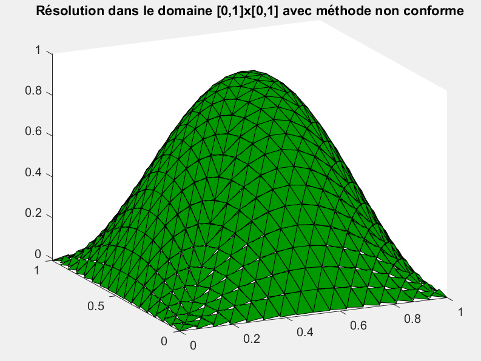
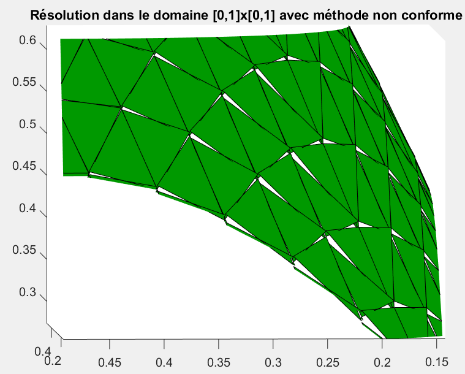

# Finite Element Method: Analysis and approximation of PDEs

This repository stores the code of an introductory course to a non-conformal Finite Elements Method. Indeed, in the first repo 'Finite-Elements-Method' is presented the classical Galerkin method. The objective of this course was to introduce new techniques to the resolution of parabolic and elliptic PDEs. The term non-conformal signifies that the numerical solution is not admissible to the abstract variational problem, which is usually the case.

On the left figure below is the numerical solution to Laplace equation in a square domain.
A simple way to observe that the solution is 'non-conformal' is the existence of discontinuities points at the interface of the finite elements on the right figure below. Indeed, it is well known that functions in Sobolev space have to be continuous throughout the interfaces, which is obviously not the case here.

 
